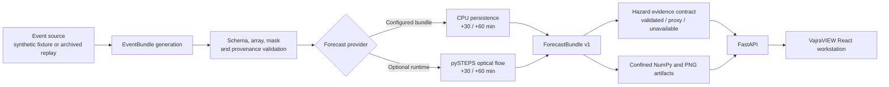

# VajraVIEW

**Convective-Scale Nowcasting for Thunderstorms, Hail & Cloudbursts**

Smart India Hackathon 2026 — SIH26084<br>
Ministry/Organisation: MoES / NCMRWF

VajraVIEW is a research prototype for evidence-led, short-range convective-weather nowcasting. The repository combines validated event packaging, deterministic forecast baselines, hazard-evidence contracts, a FastAPI service, and a capability-driven React workstation.

## The Problem

Severe convection can form, intensify, split, and decay faster than coarse numerical guidance can resolve at local scales. A useful 0–6 hour decision workflow must combine frequently updated observations, preserve data quality and provenance, expose only supported forecast horizons, and communicate uncertainty without turning a radar signal into an unsupported hazard claim. VajraVIEW addresses the first runnable part of that workflow: reproducible ingestion, short-lead baseline nowcasts, evidence-aware API outputs, and an interactive review surface.

## Our Solution — VajraVIEW

VajraVIEW loads a validated `EventBundle` containing observed meteorological arrays, grid metadata, source provenance, and a quality mask. The current runnable forecast layer provides CPU persistence at +30 and +60 minutes and can expose a pySTEPS Lucas–Kanade optical-flow baseline when its optional environment passes readiness checks. Every run is serialized as a `ForecastBundle` with its actual method, supported leads, timestamps, source metadata, numeric NumPy artifacts, and browser-displayable PNG frames. A FastAPI service publishes capabilities, events, forecasts, saved runs, and confined artifacts. The React dashboard discovers those capabilities at runtime and presents forecast frames, provenance, quality state, hazard availability, and research architecture without fabricating unsupported data.

## Key Features

- Validated `EventBundle` ingestion with schema, shape, cadence, grid, mask, and provenance checks.
- CPU persistence forecasts for the explicitly supported +30 and +60 minute leads.
- Optional pySTEPS Lucas–Kanade optical-flow baseline with runtime and event readiness checks.
- `ForecastBundle` persistence with stable run identity and confined `.npy`/PNG artifacts.
- Transparent invalid pixels in display PNGs while numeric arrays preserve `NaN` mask semantics and valid zero values.
- FastAPI capability discovery, event inventory, synchronous nowcast creation, saved-run retrieval, and artifact serving.
- React/Vite workstation with lead selection, forecast canvas, provenance ledger, hazard evidence panels, and GIS rendering when valid bounds exist.
- Deterministic synthetic fixture generation for offline demonstrations and integration testing.
- Optional bounded NOAA MRMS archived-replay builder with documented provenance; it is separate from Indian validation.

## System Architecture



The intended wider 0–6 hour system is represented as research architecture in the interface. The committed runnable providers advertise only the horizons they can actually produce.

## Technology Stack

| Layer | Technologies |
|---|---|
| Frontend | React 18, Vite, Leaflet, React-Leaflet, JavaScript, CSS |
| Backend | Python 3.11/3.12, FastAPI, Uvicorn, Pydantic |
| ML / Scientific | NumPy, deterministic persistence, optional pySTEPS 1.21.5 Lucas–Kanade optical flow |
| Data / Storage | JSON manifests, `EventBundle`/`ForecastBundle` contracts, NumPy arrays, PNG artifacts, local run directories |
| Testing / Tooling | pytest, FastAPI TestClient, Node test runner, Vite production build |

## Repository Structure

```text
.
├── src/nowcast/
│   ├── api/          # FastAPI routes and display artifact generation
│   ├── data/         # Event generation, ingestion, validation and replay tools
│   ├── evaluation/   # MAE, RMSE, CSI, POD and FAR evaluation utilities
│   ├── hazards/      # Hazard evidence/status contract
│   └── models/       # Persistence and optional optical-flow providers
├── web/              # React/Vite dashboard and frontend contract tests
├── tests/            # Backend unit and end-to-end integration tests
├── fixtures/         # Metadata-only illustrative API fixture
├── configs/data/     # Data-source manifests and replay configuration
├── scripts/          # Launch, forecast and evaluation commands
├── docs/             # API, contracts, provenance, integration and run guides
├── requirements-app.txt
├── requirements-model.txt
└── environment-optical-flow.yml
```

Generated environments, downloaded datasets, model weights, run artifacts, caches, and frontend dependencies are intentionally excluded from Git.

## Running VajraVIEW Locally

### 1. Clone and prepare the backend

```powershell
git clone https://github.com/shawnmbindosh2006-ai/sih26084-nowcast.git
cd sih26084-nowcast

py -3.11 -m venv .venv
.\.venv\Scripts\python.exe -m pip install -r requirements-app.txt
$env:PYTHONPATH = (Resolve-Path src).Path

if (-not (Test-Path runs\demo-event\event.json)) {
    .\.venv\Scripts\python.exe -m nowcast.data generate runs\demo-event
}

.\.venv\Scripts\python.exe -m nowcast.data validate runs\demo-event\event.json
$env:NOWCAST_EVENT_BUNDLE_PATH = (Resolve-Path runs\demo-event\event.json).Path
$env:NOWCAST_RUNS_DIR = (Join-Path (Get-Location) "runs\api")
.\.venv\Scripts\python.exe -m uvicorn nowcast.api.app:app --app-dir src --host 127.0.0.1 --port 8000
```

If `py` is unavailable, use an installed Python 3.11 or 3.12 executable in the virtual-environment command.

### 2. Start the frontend in a second PowerShell window

```powershell
cd sih26084-nowcast\web
npm ci
$env:VITE_API_BASE_URL = "http://127.0.0.1:8000"
npm run dev -- --host 127.0.0.1 --port 5173
```

Open [http://127.0.0.1:5173](http://127.0.0.1:5173). Confirm the API separately at [http://127.0.0.1:8000/health](http://127.0.0.1:8000/health).

### One-command Windows demo

The supported launcher creates or reuses the validated synthetic EventBundle, installs dependencies, builds the dashboard, and starts both services:

```powershell
powershell -ExecutionPolicy Bypass -File scripts/start-demo.ps1
```

See [docs/LOCAL_RUN.md](docs/LOCAL_RUN.md) for fixture-only mode, manual smoke requests, the optional optical-flow environment, and archived MRMS replay instructions.

## Demo / Test Data

`fixtures/demo-event.json` is a committed metadata-only fixture for the illustrative +15 minute API path. It contains no observed meteorological array and must not be interpreted as a forecast.

`python -m nowcast.data generate runs\demo-event` creates deterministic synthetic observed arrays, a quality mask, provenance, and separate evaluation targets. When its `event.json` is supplied through `NOWCAST_EVENT_BUNDLE_PATH`, the API advertises the persistence pipeline at +30/+60. Persistence repeats the final observed field; it is a plumbing and comparison baseline, not learned AI inference or demonstrated forecast skill.

The optional MRMS workflow builds a bounded US archived replay and records its provenance. It does not establish Indian transfer performance. Generated arrays and run artifacts stay under ignored directories and are not committed.

## API

| Method | Endpoint | Purpose |
|---|---|---|
| `GET` | `/health` | Service status and active baseline mode |
| `GET` | `/api/v1/capabilities` | Callable providers, events and supported lead times |
| `GET` | `/api/v1/events` | Available fixture and configured EventBundle events |
| `POST` | `/api/v1/nowcasts` | Create a synchronous forecast for an advertised method and lead |
| `GET` | `/api/v1/nowcasts/{run_id}` | Retrieve a saved `ForecastBundle` |
| `GET` | `/api/v1/artifacts/{run_id}/{filename}` | Retrieve a registered PNG or NumPy artifact |

Example verification:

```powershell
Invoke-RestMethod http://127.0.0.1:8000/health
Invoke-RestMethod http://127.0.0.1:8000/api/v1/capabilities | ConvertTo-Json -Depth 8
```

## Testing

Run the backend suite from the repository root:

```powershell
$env:PYTHONPATH = (Resolve-Path src).Path
.\.venv\Scripts\python.exe -m pytest -q --basetemp runs\pytest-temp `
  tests\data tests\models tests\evaluation tests\api tests\hazards
```

Run the frontend contract tests and production build:

```powershell
cd web
npm test
npm run build
```

The suites cover EventBundle validation, target isolation, mask/`NaN` handling, supported-lead rejection, persistence and optical-flow routing, evaluation edge cases, hazard availability, API/artifact confinement, capability discovery, and API-shaped dashboard rendering.

## Current Validation Status / Limitations

- VajraVIEW is a research and hackathon prototype; its outputs are not operational warnings.
- The fully integrated pip-based demo uses deterministic persistence at +30/+60, not learned-model inference.
- Optical flow is optional and is advertised only when its runtime and configured event pass readiness checks.
- No committed result demonstrates calibrated hail, lightning, cloudburst, or downburst probabilities. Unsupported hazards remain `unavailable` with `probability=null`.
- The wider 0–6 hour routing, multi-sensor fusion, storm lineage, and arrival-corridor components are research architecture, not demonstrated forecast skill.
- The committed workflow does not establish Indian forecast validation, operational availability, or live-feed integration.
- PNG frames are independently normalized visual previews; NumPy artifacts retain the underlying numeric values and masks.

## Screenshots

Final screenshots are not committed yet. Before making the repository public, capture the following screens at 16:9 resolution and add them under `docs/screenshots/`:

1. `vajraview-dashboard.png` — full workstation with API state visible.
2. `forecast-canvas.png` — radar/forecast canvas with +30 or +60 selected.
3. `hazard-evidence.png` — hazard panel and trust ledger showing evidence status.
4. `lead-time-view.png` — supported lead controls and generated forecast artifacts.
5. `verification.png` — successful capabilities response and test summary without local user paths.

After adding the files, embed them here with relative paths such as `docs/screenshots/vajraview-dashboard.png`.

## SIH26084

VajraVIEW is a response to Smart India Hackathon 2026 Problem Statement SIH26084 from MoES / NCMRWF: convective-scale nowcasting for thunderstorms, hail, and cloudbursts. The repository demonstrates a tested baseline architecture that can be extended with additional Indian observation sources and validated forecast providers while retaining strict provenance and capability reporting.

## Team

- **Shawn** — Project Lead
- **Manish** ([manishj2007](https://github.com/manishj2007)) — model integration, evaluation, dependency reconciliation, and launch scripts
- **Harinandana** ([bluebvrrie](https://github.com/bluebvrrie)) — data ingestion, validation, quality, and provenance
- **Devananda** ([devanandabipin](https://github.com/devanandabipin)) — API, shared contract, and hazard evidence
- **Anamika** ([anamikapvivekan05-ops](https://github.com/anamikapvivekan05-ops)) — dashboard, GIS display, and demonstration evidence
- **Ayush** — Team member

## Disclaimer

VajraVIEW is a Smart India Hackathon research prototype. It is not an official meteorological forecast, emergency alert, or public-warning service.
